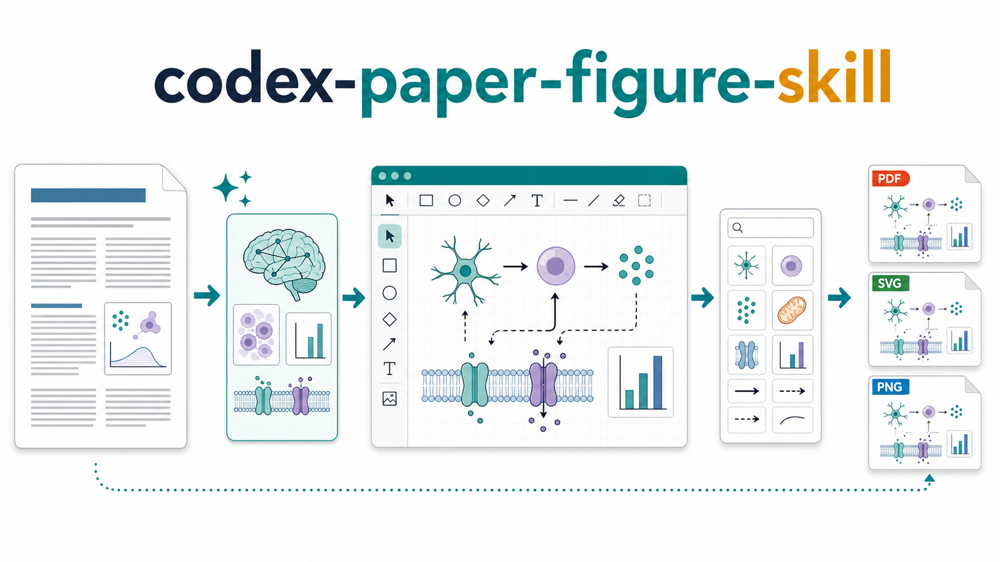
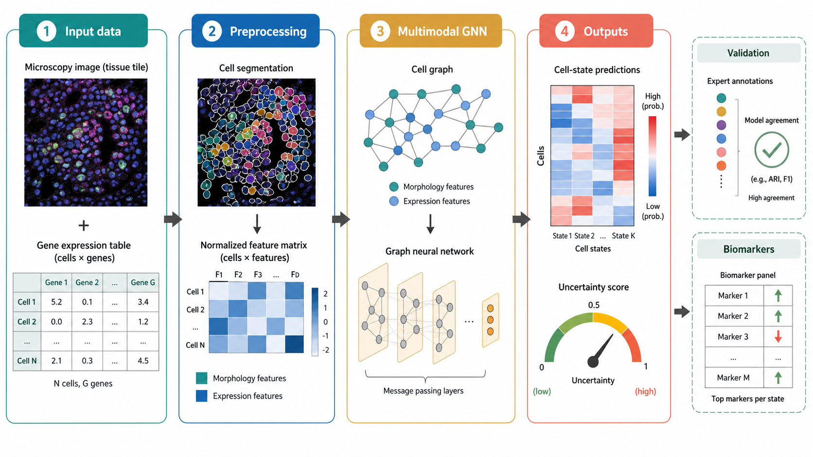
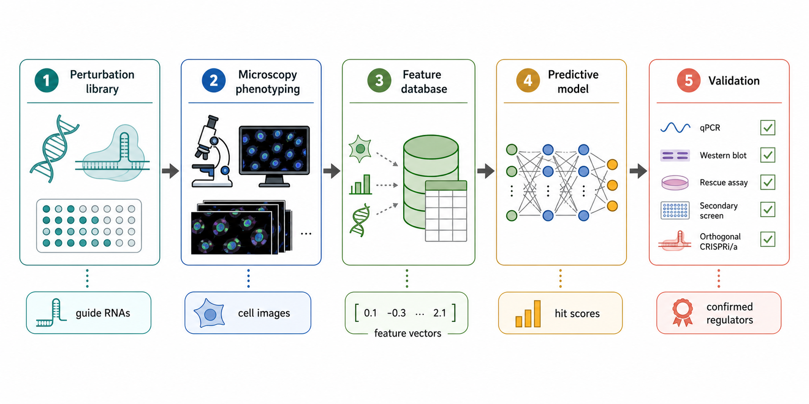
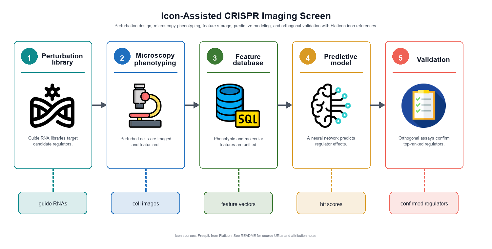

# codex-paper-figure-skill

[English](README.md)



一个 Codex skill，用于把论文段落、方法描述和配图想法转换成可编辑的 draw.io 学术图。

`codex-paper-figure-skill` 会读取自然语言科学内容，先用 Codex `image_gen` 生成视觉参考图，再把最终结果重建为原生 `.drawio` 图。主要输出不是扁平化 PNG：读者后续可以在 draw.io / diagrams.net 中打开 `.drawio` 文件，直接编辑标签、形状、箭头、分组、布局、颜色和图标元素。

**可编辑优先：** 生成的 `.drawio` 文件是主要交付物。除非你明确要求，否则 raster 图片只作为参考图或预览图使用。

## 功能

- 根据 manuscript text 生成论文风格的 workflow diagram、mechanism figure、model architecture figure、experimental design diagram 和 graphical abstract draft。
- 用 `image_gen` 探索构图，再把最终图重建成可编辑 draw.io XML。
- 保留科学标签、形状、箭头、分组和图标的可编辑性，而不是把它们压平成单张 raster image。
- 当图标能提升图示清晰度时，使用 Codex 内置 `Browser` 搜索 Flaticon。
- 以 `.drawio` 作为主要产物，方便读者后续继续修改；PDF/SVG/PNG 只是可选展示格式。

## 使用要求

必需：

- 支持本地 skill 的 [Codex](https://openai.com/codex/)。
- Codex `image_gen`，用于生成 raster reference image。

可选：

- Codex 内置 `Browser`，用于从 [Flaticon](https://www.flaticon.com/) 搜索图标。
- [draw.io / diagrams.net](https://www.drawio.com/)，用于打开和编辑生成的 `.drawio` 文件。
- draw.io Desktop，推荐 macOS 用户安装，Windows/Linux 用户也可安装。Desktop 版提供本地应用和 CLI，Codex 可用它自动导出 PDF/SVG/PNG。

[app.diagrams.net](https://app.diagrams.net/) 网页版可以打开、编辑和手动导出 `.drawio` 文件，用于编辑已经足够。如果希望 Codex 自动渲染 PDF/SVG/PNG，请安装 draw.io Desktop。

## 快速开始

直接从本仓库引用 skill：

```text
[$codex-paper-figure-skill](./codex-paper-figure-skill/SKILL.md)

Create an editable draw.io academic figure from the paper text below:
<paste a paper section, methods paragraph, results summary, or figure idea>
```

预期输出：

- 一张由 `image_gen` 生成的参考图。
- 一个可编辑 `.drawio` 文件，可在 draw.io / diagrams.net 中重新打开并继续修改。
- 如果你要求导出且本地环境支持，可能还会生成预览或导出文件。

## 安装

你可以用两种方式使用这个 skill。

### 方式 1：从本仓库直接引用

保持仓库结构不变，在 Codex 中显式引用 skill 文件：

```text
[$codex-paper-figure-skill](./codex-paper-figure-skill/SKILL.md)
```

这是测试 skill 和复现实例最简单的方式。

### 方式 2：安装为本地 Codex Skill

把 skill 文件夹复制到你的 Codex skills 目录：

```text
<Codex skills directory>/
└── codex-paper-figure-skill/
    ├── SKILL.md
    └── agents/
        └── openai.yaml
```

只需要复制内部的 `codex-paper-figure-skill/` 文件夹。仓库根目录的 `outputs/` 只包含示例，不是安装必需内容。

## 仓库结构

```text
codex-paper-figure-skill/
├── assets/
│   └── repo-hero.png
├── codex-paper-figure-skill/
│   ├── SKILL.md
│   └── agents/
│       └── openai.yaml
├── LICENSE
├── outputs/
│   ├── multimodal-gnn/
│   │   ├── demo-multimodal-gnn-reference.png
│   │   └── demo-multimodal-gnn.drawio
│   └── icon-crispr/
│       ├── demo-icon-crispr-reference.png
│       ├── demo-icon-crispr-preview.png
│       ├── demo-icon-crispr-preview.svg
│       └── demo-icon-crispr.drawio
└── README.md
```

## 工作原理

1. 把输入解析成 figure brief：scientific message、entities、relationships、required labels、layout constraints 和 output format。
2. 使用 Codex `image_gen` 生成 raster reference，用于探索布局、风格和视觉层级。
3. 把图重建为原生 draw.io mxGraphModel XML。
4. 让标签、形状、箭头、分组和图标元素在 draw.io 中保持可编辑。
5. 校验 `.drawio` XML 是否包含必要 root cells 并且可以解析。
6. 只有在用户要求且 draw.io Desktop CLI 可用时，才导出 PDF/SVG/PNG。

## 输出

这个 skill 优先交付可编辑输出：

| 输出 | 用途 |
| --- | --- |
| `.drawio` | 主要可编辑图文件。后续可在 draw.io / diagrams.net 中打开并编辑文字、形状、箭头、布局和样式。 |
| `*-reference.png` | 由 `image_gen` 生成的 raster reference，用于构图参考，不是最终可编辑图。 |
| `*-preview.png` / `*-preview.svg` | 可选视觉预览，用于 README、审阅或分享。 |
| `.drawio.pdf` / `.drawio.svg` / `.drawio.png` | draw.io Desktop CLI 可用时的可选导出文件。 |
| `icons/` | 使用外部图标时，可选的图标资源目录。 |

## 示例

| 示例 | 参考图 | 可编辑输出 | 预览 | 说明 |
| --- | --- | --- | --- | --- |
| Multimodal GNN pipeline | [PNG](outputs/multimodal-gnn/demo-multimodal-gnn-reference.png) | [draw.io](outputs/multimodal-gnn/demo-multimodal-gnn.drawio) | - | 只使用 draw.io 原生形状，没有外部图标。 |
| Icon-assisted CRISPR screen | [PNG](outputs/icon-crispr/demo-icon-crispr-reference.png) | [draw.io](outputs/icon-crispr/demo-icon-crispr.drawio) | [PNG](outputs/icon-crispr/demo-icon-crispr-preview.png), [SVG](outputs/icon-crispr/demo-icon-crispr-preview.svg) | 使用 Flaticon icon image cells。 |

### Multimodal GNN Pipeline

示例输入：

```text
A multimodal analysis pipeline integrates raw microscopy images and gene-expression tables. Images are segmented into cell instances, expression profiles are normalized, a graph neural network combines morphology and molecular features, and the model outputs cell-state predictions with uncertainty scores. Results are validated against expert annotations and summarized as biomarker panels.
```

由 `image_gen` 生成的参考图：



可编辑 draw.io 文件：

[outputs/multimodal-gnn/demo-multimodal-gnn.drawio](outputs/multimodal-gnn/demo-multimodal-gnn.drawio)

验证：XML 可成功解析，包含必要 root cell `0`、默认 parent cell `1`，以及 `199` 个 `mxCell` 元素。

### Icon-Assisted CRISPR Screen

示例输入：

```text
An icon-assisted CRISPR imaging screen links perturbation design, microscopy phenotyping, feature storage, neural network modeling, and orthogonal validation. Guide RNA libraries target candidate regulators, microscopy images are collected after perturbation, phenotypic and molecular features are stored in a unified database, a neural network predicts regulator effects, and top hits are validated with checklist-style orthogonal assays.
```

由 `image_gen` 生成的参考图：



用 Flaticon icon 重建后的预览：



可编辑 draw.io 文件：

[outputs/icon-crispr/demo-icon-crispr.drawio](outputs/icon-crispr/demo-icon-crispr.drawio)

SVG 预览：

[outputs/icon-crispr/demo-icon-crispr-preview.svg](outputs/icon-crispr/demo-icon-crispr-preview.svg)

验证：XML 可成功解析，包含必要 root cell `0`、默认 parent cell `1`、`49` 个 `mxCell` 元素，以及 `5` 个 icon image cells。SVG 预览也可成功解析，并包含 `5` 个 icon image elements。

图标来源：

- [DNA icon](https://www.flaticon.com/free-icon/dna_9236703)
- [Microscope icon](https://www.flaticon.com/free-icon/microscope_1046273)
- [Database icon](https://www.flaticon.com/free-icon/database_4248443)
- [Neural network icon](https://www.flaticon.com/free-icon/neural-network_16894263)
- [Checklist icon](https://www.flaticon.com/free-icon/checklist_1028911)

Attribution: icons designed by Freepik from Flaticon. Flaticon 免费素材通常要求 attribution；复用或再分发前，请核对当前 icon 页面和 license。

## 图标工作流

图标是可选的。只有当图标能让科学图更清晰时才使用。

1. 使用 Codex 内置 `Browser` 打开 [Flaticon](https://www.flaticon.com/)。
2. 搜索准确概念，并添加风格词，例如 `line`、`outline`、`filled`、`flat` 或 `science`。
3. 优先选择 free、non-premium，且来自同一作者或同一风格系列的图标。
4. 打开每个 icon detail page，记录 icon URL、author/designer、license 和 attribution requirement。
5. 如果可用且授权允许，优先选择 SVG/vector assets。
6. 把下载的项目图标保存到当前输出目录下，推荐放在 `icons/`。
7. 如果 license terms、author 或 download source 不清楚，改用可编辑 draw.io shape。

## draw.io 导出

这个 skill 总是先创建 `.drawio` 文件。

如果安装了 draw.io Desktop CLI，Codex 可以尝试导出：

```bash
drawio -x -f pdf -e -b 10 -o figure.drawio.pdf figure.drawio
drawio -x -f svg -e -b 10 -o figure.drawio.svg figure.drawio
drawio -x -f png -e -b 10 -o figure.drawio.png figure.drawio
```

常见 CLI 位置：

- macOS: `/Applications/draw.io.app/Contents/MacOS/draw.io`
- Windows: `C:\Program Files\draw.io\draw.io.exe`
- Linux: `drawio` on `PATH`

如果 CLI 不可用，可以在 [app.diagrams.net](https://app.diagrams.net/) 或 draw.io Desktop 中打开 `.drawio` 文件并手动导出。

## 验证

验证 skill metadata：

```bash
python <path-to-skill-creator>/scripts/quick_validate.py ./codex-paper-figure-skill
```

发布生成图前，建议检查：

- XML 可以成功解析。
- Root cells `0` 和 `1` 存在。
- 标签是可编辑 draw.io text。
- 箭头和 panel 顺序符合 manuscript logic。
- 使用外部图标时，已记录 icon sources 和 attribution。
- 导出的预览不是空白图，没有裁切或文字重叠。

## 限制

- `image_gen` 输出是视觉参考图，不是最终可编辑交付物。
- 生成参考图中的 raster text 可能不准确；最终标签应重建为 draw.io text。
- 如果没有 draw.io Desktop CLI，可能无法自动导出 PDF/SVG/PNG。
- 外部图标可能带来授权义务。发表前请检查来源页面。
- 这个 skill 不保证符合所有期刊要求；用户仍需检查目标期刊的图尺寸、分辨率、颜色和 attribution 要求。

## License And Attribution

本仓库使用 [MIT License](LICENSE)。

MIT license 覆盖本项目创作的 skill 文件、README、代码和文档。示例输出可能包含生成图片和第三方 icon references；这些资源可能有单独条款。icon demo 中使用的 Flaticon 图标 attributed to Freepik from Flaticon。复用或再分发前，请核对每个 icon 页面的当前 license terms。

## 致谢

这个 skill 借鉴了 draw.io `SKILL.md` 的核心生成模式：原生 mxGraphModel XML、可编辑 `.drawio` 文件、XML 校验，以及通过 draw.io Desktop CLI 进行可选导出。本工作流所需的 draw.io 规则已内置在 `codex-paper-figure-skill/SKILL.md` 中，因此本仓库只暴露一个自包含 skill。

参考链接：

- [OpenAI Codex](https://openai.com/codex/)
- [draw.io AI-generated diagram guidance](https://www.drawio.com/doc/faq/ai-drawio-generation)
- [draw.io Desktop and offline usage](https://www.drawio.com/docs/manual/editor/offline/)
- [draw.io export formats](https://www.drawio.com/docs/manual/export/export-diagram/)
